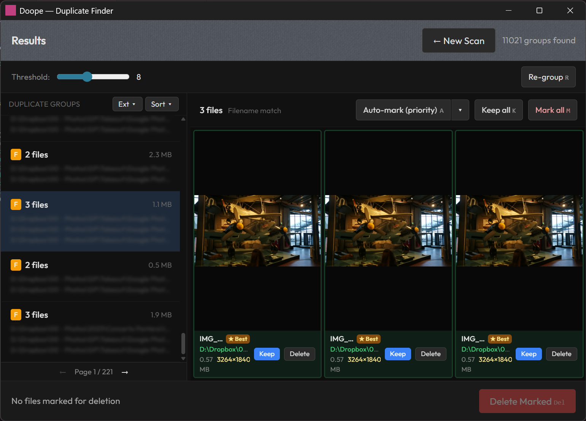

# Doope

A fast, elegant desktop app for finding and removing duplicate images and videos. **Doope** walks your folders, hashes every file, and groups duplicates using exact (BLAKE3) matching for identical files and perceptual (dHash) matching for visually similar images and video frames. Results are cached so repeated scans only process new or changed files.



## Features

- **Exact deduplication** - byte-identical files via BLAKE3
- **Perceptual deduplication** - visually similar images and video frames via dHash + BK-tree
- **Video support** - multi-frame extraction via FFmpeg
- **Persistent cache** - SQLite cache skips unchanged files on re-scan
- **Bulk delete** - review grouped duplicates and delete with one click

## Requirements

- [Node.js](https://nodejs.org/) 18+
- [Rust](https://rustup.rs/) (stable toolchain)
- [FFmpeg](https://ffmpeg.org/) on PATH (required for video deduplication)
- Tauri prerequisites for your platform — see [Tauri docs](https://tauri.app/start/prerequisites/)

## Development

```bash
npm install
npm run dev        # hot-reload dev build
npm run tauri build  # production binary
```

## Tech Stack

- **Frontend**: TypeScript + Vite (vanilla, no framework)
- **Backend**: Rust + Tauri 2
- **Hashing**: BLAKE3 (exact), dHash (perceptual)
- **Grouping**: BK-tree for O(n log n) nearest-neighbor search
- **Database**: SQLite (WAL mode) for hash caching
- **Parallelism**: Rayon + jwalk
